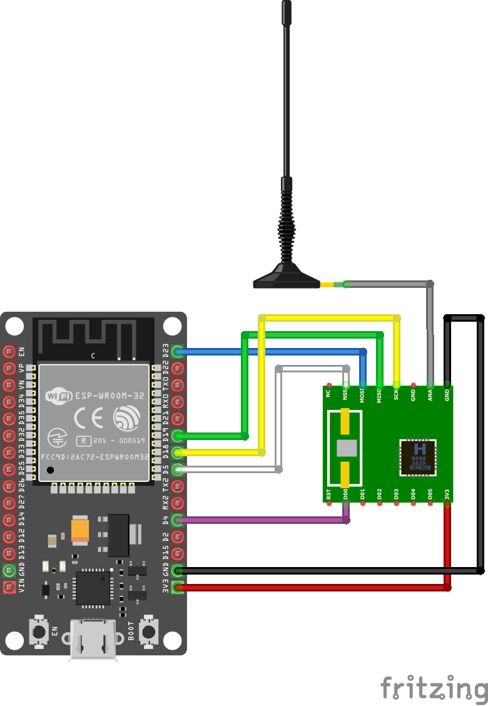

# X3D RFM69 ESP Interface

Note: work in progress
- Modulation: FSK PCM
- Frequency: 868.95 MHz
- FSK Frequency Deviation: 80 kHz
- 25 µs bit time
- 40000 baud
- based on Semtech SX1211
- manual CRC
- CCITT Data Whitening

Payload format:
- Preamble          {32} 0xaaaaaaaa
- Syncword          {32} 0x8169967e
- Length            {8}
- Payload           {n}
- CRC16(Poly=0x1021,Init=0x0000)

The RFM69HW module is based on Semtech SX1231H. The nearest target frequency is 868.950012 MHz, the internal AFC is able to take care on this gap.

X3D Protocol analysis: [X3D-Protocol.md](X3D-Protocol.md)

X3D Messages: [X3D-Message-Log.md](X3D-Message-Log.md)

Tydom Hardware analysis: [Tydom.md](Tydom.md)

## Wireing

used:
- DOIT ESP32 DEVKIT V1
- RFM69HW 868 MHz

| ESP32 | RFM69 |
|-------|-------|
| 3V3   | 3.3V  |
| GND   | GND   |
| D4    | DIO0  |
| D5    | NSS   |
| D18   | SCK   |
| D19   | MISO  |
| D23   | MOSI  |

## ESP Projects

The ESP sub projects based on ESP-IDF 5.x. Each project folder contains a vscode configuration.

* [x3d-lib](x3d-lib) - Makefile gcc project to implement and test X3D generate and parsing lib.
* [x3d-raw-monitor](x3d-raw-monitor) - Init the SX1231 chip with correct config for the X3D protocol and dumps packet hex over serial.
* [x3d-raw-mqtt-publish](x3d-raw-mqtt-publish) - Publishes Raw packet binary over mqtt.
