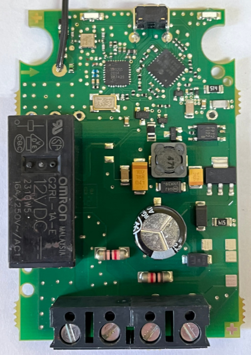
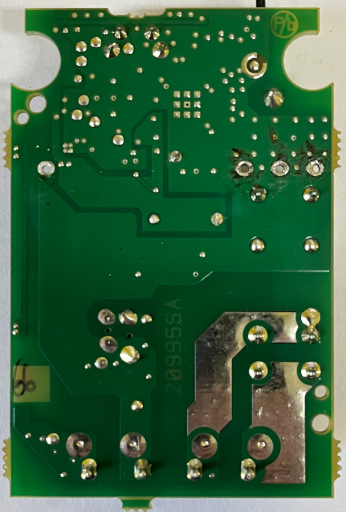

# Delta Dore RF 66xx

I assume that mostly all RF 66xx types behave the same way. From the manual it looks like they differ only on wire connections.

## Ids

* 7729928 - Frenchised RF 66xx with potential free contact
* 7729928 - Frenchised RF 66xx with potential free contact with cable
* 7729961 - Frenchised RF 66xx with powered contact with cable
* 7729962 - Frenchised RF 66xx with powered contact

## 7729962

* TT-Funk X3D Funk-Empfänger 16A / 230V
* RTU 101FE

In the lower part of the PCB next to the connectors are two resistors located. These can be moved to the free pads on the right or in the other way to switch between powered and potential free contact.

### Chips

* PIC24FJ64GA - 32 MHz, 64 KB ROM, 4 KB SRAM
* SX1211 - Ultra Low Power (3 mA RX) RF Transceiver 862-960 MHz

### PCB

