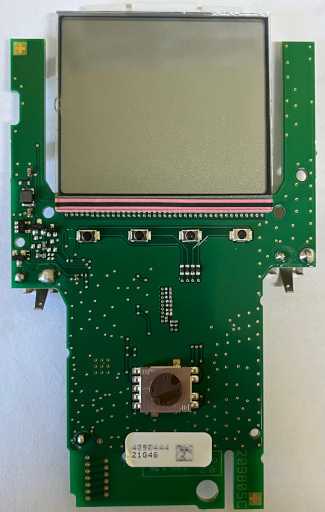
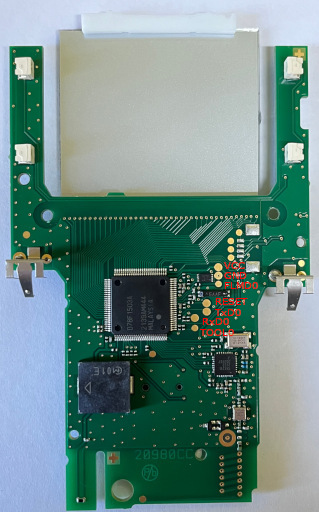

# Multifrenchise RTU 101FS

This device is mostly not direct available via Delta Dore, it is offered by diffrent sellers.

## Ids

* 7729936

## Chips

* µPD78F1503A - RENESAS 780R/LG3 20 MHz, 64 KB ROM, 4 KB SRAM
* SX1211 - Ultra Low Power (3 mA RX) RF Transceiver 862-960 MHz

## PCB

