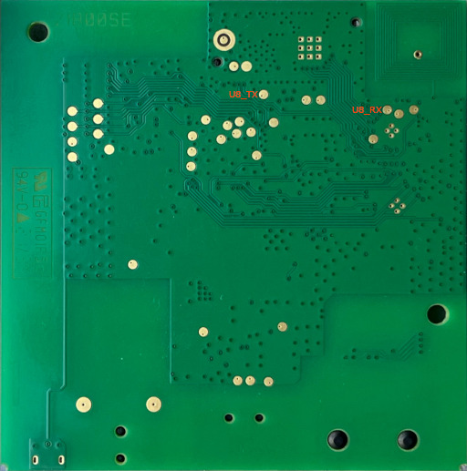

# Delta Dore Tydom 1

## Ids

* mainVersionSW 03.08.18
* mainVersionHW 00.00.01
* mainId 6700103
* mainReference 21800010
* keyVersionSW 01.04.33
* keyVersionHW 00.00.01
* keyVersionStack 04.00.50
* keyReference 21800011
* bootReference P21800012
* bootVersion 01.00.03

## Chips

* IC1 - STM32F427 - Core CPU
* IC3 - 24M01RP - 1-Mbit serial I²C bus EEPROM
* IC3 - 26F032B - 32 Mbit Serial Quad I/O (SQI) Flash Memory
* IC4 - KSZ8081 - 10/100 Base-T/TX Physical Layer Transceiver
* IC5 - R5F1007EA - RENESAS RL78/G13 64 KB ROM
* IC6 - M24LR16E-RMC6T/2 - Dynamic NFC/RFID tag IC with 16-Kbit EEPROM
* RF - ??? unknown

## PCB

